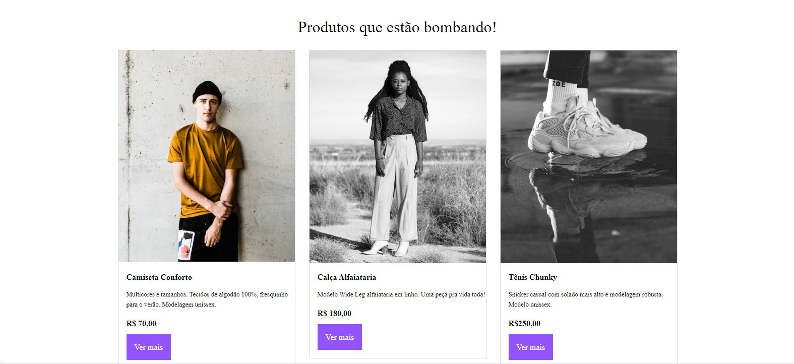

# meteora

 # Site Meteora 🌐

🔧 **Descrição curta do projeto**  
Este projeto é um site feito para [para simular uma pagina de um site de vendas]. Ele oferece [Demonstração de uma pagina de um projeto]. É um site [visualmente atraente, ].

---

## 🚀 Funcionalidades

- **Design Responsivo**: O site se adapta automaticamente a diferentes tamanhos de tela (desktop)
- **Interatividade**: [Descrição de uma funcionalidade interativa, como animações, formulários ou APIs externas].
- **Acessibilidade**: Garantia de que o site é fácil de navegar para todos, incluindo usuários com deficiências.
- **SEO otimizado**: Estrutura projetada para ser amigável aos mecanismos de busca.

---

## ⚡ Tecnologias Utilizadas

- **HTML5**: Estrutura e conteúdo do site.
- **CSS3**: Estilos modernos e 

## 📷 Foto do Produto

## 📞 Contato
Se você tiver alguma dúvida ou sugestão, não hesite em me contatar!

Email: luanlutii@gmail.com

GitHub: LuanRF115